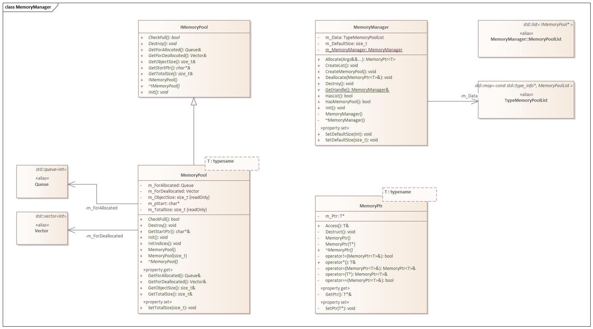

# 메모리 매니저와 메모리 풀 구현

## 개요
메모리 매니저와 메모리 풀은 메모리 초기화 및 할당 작업을 효율적으로 처리하기 위해 설계되었습니다. 메모리 매니저는 여러 개의 메모리 풀을 중앙 관리하며, 메모리 초기화 및 새로운 메모리 풀 생성을 위한 인터페이스를 제공합니다.

## 동기
메모리 매니저의 주요 목적은 두 가지입니다:
1. 외부 객체가 메모리 풀 내에서 메모리 초기화 및 할당 작업을 수행할 수 있도록 하는 것입니다.
2. 여러 개의 메모리 풀을 효율적으로 관리하고 조정하는 것입니다.

## 구현 지침
메모리 매니저와 메모리 풀을 구현할 때 다음 지침을 따라 적절한 기능을 보장합니다:

### 메모리 풀 할당
- 메모리 풀은 메모리 할당을 지원하지 않아야 합니다. 왜냐하면 메모리 초기화로 반환된 포인터들이 무효화될 수 있기 때문입니다.
- 메모리 풀은 링크드 리스트로 구성되어야 합니다. 각 리스트는 특정 객체 유형에 해당하는 메모리 풀을 가리킵니다.
- 메모리 풀이 가득 차면, 새로운 메모리 풀을 생성하고 기존 풀과 연결해야 합니다.

### 생성자와 소멸자
- 메모리 매니저는 싱글턴 패턴을 사용하여 응용 프로그램 수명 내내 하나의 인스턴스로 구현되어야 합니다.

### 초기화
#### 기본 크기 설정
- 메모리 풀에 대한 기본 크기를 설정해야 합니다. 기본적으로 크기는 512로 설정되며, 별도로 지정하지 않은 경우 이 값을 사용합니다.

#### 메모리 풀 리스트 생성
- 메모리 풀을 초기화하기 전에, 주어진 객체 유형에 해당하는 리스트가 이미 맵에 존재하는지 확인해야 합니다.
- 리스트가 존재하지 않는 경우, 새로운 리스트를 생성해야 합니다.

#### 메모리 풀 생성
- 응용 프로그램의 수요에 따라 필요할 때 메모리 풀을 생성해야 합니다.

### 할당 해제
#### 객체 할당 해제
- 객체를 해제할 때, 해당 객체 유형에 대한 메모리 풀을 반복적으로 확인해야 합니다.
- 객체의 현재 주소와 관련된 메모리 풀의 시작 주소를 비교하여 객체를 해제할 수 있는지 확인해야 합니다.

## 주요 구성 요소
이 코드는 C++에서 메모리 매니저와 메모리 풀의 구현을 제공합니다. 메모리 매니저, 메모리 풀 및 관련 클래스를 사용하여 메모리 풀에서 객체의 동적 할당 및 해제를 가능하게 합니다.

- `IMemoryPool`: 메모리 풀에 대한 공통 메서드와 속성을 정의하는 인터페이스 클래스입니다.
- `MemoryPool`: 메모리 풀을 구현하는 템플릿 클래스입니다. 저장될 객체 유형을 매개변수로 사용합니다.
- `MemoryManager`: 여러 개의 메모리 풀을 관리하는 싱글턴 클래스입니다. 메모리 풀 생성, 객체 할당 및 해제, 메모리 매니저의 초기화 및 소멸에 대한 메서드를 제공합니다.
- `MemoryPtr`: 메모리 풀에서 할당된 메모리에 대한 포인터입니다.

## 사용법
1. `Log.h`, `IMemoryPool.h`, `MemoryPool.h`, `MemoryManager.h`, `MemoryPtr.h` 와 같은 필요한 헤더 파일을 포함시킵니다.
2. `MemoryManager::GetHandle()`을 사용하여 메모리 매니저의 새 인스턴스를 생성합니다.
3. 필요에 따라 `SetDefaultSize(size)`를 사용하여 메모리 풀의 기본 크기를 설정합니다. 이는 각 메모리 풀에 사용 가능한 전체 메모리의 크기를 정의합니다.
4. `Create<T>(args...)`를 사용하여 메모리 풀에서 객체를 할당합니다. 이는 `T` 유형의 객체를 할당하고 해당 객체에 대한 `MemoryPtr`을 반환합니다. `T`에 대한 메모리 풀이 존재하지 않는 경우 자동으로 생성됩니다.
5. `Delete<T>(object)`를 사용하여 객체를 해제합니다. 이는 객체가 사용하던 메모리를 해제하고 재사용 가능하게 만듭니다.
6. `Destroy()`를 사용하여 메모리 매니저를 소멸시키고 모든 메모리를 해제합니다.

제공된 코드에는 `WinMain` 함수에서 사용 예시가 포함되어 있습니다. 메모리 풀 생성, 객체 할당 및 해제, `Log` 클래스를 사용하여 로그 메시지를 검색하는 방법을 보여줍니다.

제공된 코드에는 `Log` 클래스의 구현이 포함되어 있지 않으므로, 직접 구현하거나 로깅 시스템과 함께 작동하도록 코드를 수정해야 합니다.

더 많은 세부 정보와 사용 예시에 대해서는 제공된 파일의 소스 코드와 주석을 참조해주세요.

# Memory Manager and Memory Pool Implementation

## Overview
The Memory Manager and Memory Pool are designed to efficiently handle memory initialization and deallocation tasks. The Memory Manager acts as a central manager for multiple Memory Pools, providing an interface for memory initialization and creating new Memory Pools.

## Motivation
The Memory Manager serves two primary purposes:
1. Allowing external objects to perform memory initialization and deallocation tasks within the Memory Pool.
2. Managing and coordinating multiple Memory Pools effectively.

## Implementation Guidelines
To ensure proper functionality, follow these guidelines when implementing the Memory Manager and Memory Pool:

### Memory Pool Allocation
- Memory Pools should not support reallocation, as it would invalidate pointers returned during memory initialization.
- Organize Memory Pools as linked lists, with each list corresponding to a specific object type.
- When a Memory Pool becomes full, create a new Memory Pool and link it to the existing ones.

### Constructor and Destructor
- Implement the Memory Manager using the Singleton pattern to ensure a single instance throughout the application's lifetime.

### Initialization
#### Default Size Configuration
- Set a default size for the Memory Pools. By default, the size is set to 512 unless specified otherwise.

#### Memory Pool List Creation
- Before initializing a Memory Pool, check if a list for the given object type already exists in the map.
- If the list does not exist, create a new one.

#### Memory Pool Creation
- Create Memory Pools as needed, based on the demand from the application.

### Deallocation
#### Object Deallocation
- When deallocating objects, iterate through the Memory Pools of the corresponding object type.
- Determine if an object can be deallocated by comparing its current address with the start address of the associated Memory Pool.

## Key Components
The code provides an implementation of a memory manager and memory pool in C++. The Memory Manager, MemoryPool, and related classes enable dynamic allocation and deallocation of objects from memory pools.

- `IMemoryPool`: An interface class that defines the common methods and properties for a memory pool.
- `MemoryPool`: A template class that implements the memory pool. It is parameterized by the type of objects to be stored in the pool.
- `MemoryManager`: A singleton class that manages multiple memory pools. It provides methods for creating memory pools, allocating and deallocating objects, and initializing and destroying the memory manager.
- `MemoryPtr` : A pointer to allocated memory in the Memory Pool.

## Usage
1. Include the necessary headers: `Log.h`, `IMemoryPool.h`, `MemoryPool.h`, `MemoryManager.h` and `MemoryPtr.h`.
2. Create a new instance of the memory manager using `MemoryManager::GetHandle()`.
3. Optionally, set a default size for the memory pools using `SetDefaultSize(size)`. This defines the total size of memory available for each memory pool.
4. Allocate objects from a memory pool using `Create<T>(args...)`. This allocates an object of type `T` and returns a `MemoryPtr` to it. If a memory pool for `T` does not exist, it will be created automatically.
5. Deallocate objects using `Delete<T>(object)`. This frees the memory occupied by the object and makes it available for reuse.
6. Destroy the memory manager and release all memory using `Destroy()`.

The provided code includes a sample usage scenario in the `WinMain` function. It demonstrates creating memory pools, allocating and deallocating objects, and retrieving log messages using the `Log` class.

Please note that the code provided does not include the implementation of the `Log` class, so you would need to provide your own implementation or modify the code to work with your logging system.

For more details and usage examples, please refer to the source code and comments in the provided files.

# MemoryProject Tutorial
[Link to Tutorial](./TUTORIAL.md)

# Class Diagram

