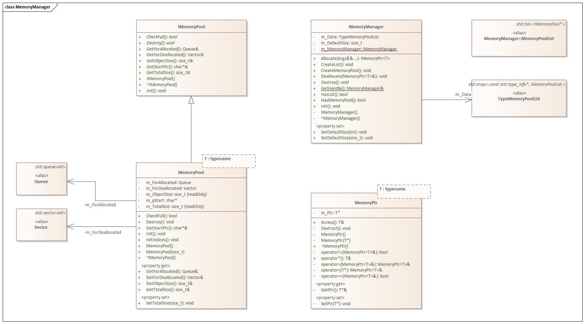

# Log & Memory Project

## MemoryProject Tutorial
[Link to Tutorial](./TUTORIAL.md)

---



# Summary

- Creating auxiliary libraries for ECS
    - Log Project
    - Memory Project

## 🛠️ Technology Stack and Libraries

- Language
    - C++

## 📝 Overview

### Log

- Functionality for printing engine-related information
- Ability to separately store log information
- Need to categorize log information:
    - Info: General information
    - Warn: Information requiring attention but not causing runtime errors
    - Error: Information causing runtime errors or requiring exception handling

### Memory Pool & Manager

- To efficiently handle memory initialization and allocation tasks
- To centralize the management of various types of instances

### Memory Ptr

- Implemented in a manner similar to smart pointers
- Addressing memory-related issues when returning pointers to objects in ECS
- Only destructible from the **Memory Manager**

### Creating Libraries and Setting Dependencies Using CMake

- Configuration of CMakeLists for creating Log and Memory Projects as libraries
- Creating a GitHub repository and establishing dependencies for usage

## 📝 Development Details

### [Memory Project]

### Interfaces

- **IMemoryPool**

### [Log Project]

### Classes

- Log

### Classes

- MemoryPool (Parent: IMemoryPool)
- MemoryPtr

### Managers

- MemoryManager

### [Common]

### CMakeLists Configuration

## 📝 Detailed Development Description

### Interfaces

- **IMemoryPool**
    - Interface for objects using **MemoryPool**
        
        ```cpp
        class IMemoryPool
        {
            public:
                IMemoryPool() {}
                virtual ~IMemoryPool() {}
        
            public:
                virtual void Init() = 0;
                virtual Destroy() = 0;
                virtual bool CheckFull() = 0;
                virtual bool CheckEmpty() = 0;
        
            public:
                virtual const size_t& GetTotalSize() = 0;
                virtual const size_t& GetObjectSize() = 0;
        
                virtual char*& GetStartPtr() = 0;
        };
        ```
        

### Classes

- **MemoryPool**
    - Main roles:
        - Actual allocation and deallocation of memory
        - Manages instances by allocating all memory at once and using initialization and destructors
    - Memory management:
        - Manages memory using the initial address and object size index information obtained from the **MemoryPool**
            - For example:
                - Allocated address: 01
                - Memory size: 8
                - Object size: 2
                - Possible object indices (addresses): 0(01), 1(03), 2(05), 3(07)
        - Allocates memory when the **MemoryPool** is initially created
            - **void Init()**
                - Allocates memory using malloc
                - Populates the **m_CanConstruct** queue with indices of constructable instances
                - **m_CanConstruct**:
                    - A queue containing index information for instances that can be initialized
                - **m_CanDestruct**:
                    - A queue containing index information for instances that can be destructed
                
                ```cpp
                void Init()
                {
                    m_pStart = static_cast<char*>(std::malloc(m_TotalSize));
                
                    for (size_t I = 0; I < m_TotalSize / m_ObjectSize; I++)
                    {
                        m_CanConstruct.push(static_cast<int>(I));
                    }
                
                    m_CanDestruct.clear();
                    m_CanDestruct.reserve(static_cast<int>(m_TotalSize / m_ObjectSize));
                
                    return;
                }
                ```
                
        - The allocated memory persists until the **MemoryPool** is destroyed
    - Instance management:
        - Creation and destruction are managed using instance pointers
            - **m_CanConstruct**:
                - A queue containing index information for instances that can be initialized
            - **m_CanDestruct**:
                - A queue containing index information for instances that can be destructed
            - Creation:
                - *template< typename … Args > T Construct(Args&&… args)*
                    - Checks if the **MemoryPool** is full
                        - Returns true if **m_CanConstruct** is empty
                    - Uses an available index to call placement new for object construction
                
                ```cpp
                template< typename ... Args >
                T* Construct(Args&&... args)
                {
                    if (CheckFull())
                    {
                        throw Except("MemoryPool | %s | %s | This MemoryPool is full", __FUNCTION__, typeid(T).name());
                    }
                
                    int Index = m_CanConstruct.front();
                    m_CanDestruct.push_back(Index);
                    m_CanConstruct.pop();
                
                    T* Ptr = new (GetStartPtr() + Index * GetObjectSize()) T(std::forward<Args>(args)...);
                
                    Log::Info("Instance | %s | %p | Create new", typeid(T).name(), Ptr);
                
                    return Ptr;
                }
                ```
                
            - Destruction:
                - *void Destruct(T& Ptr)*
                    - Uses the Ptr to find the index at which the instance can be destructed from the **MemoryPool**
                    - If an index is found:
                        - Calls the destructor of the instance and sets it to nullptr
                        - Updates **m_CanConstruct** and **m_CanDestruct**
                    
                    ```cpp
                    void Destruct(T*& Ptr)
                    {
                        int Index = static_cast<int>((reinterpret_cast<char*>(Ptr) - GetStartPtr()) / GetObjectSize());
                    
                        auto ITR = std::remove(m_CanDestruct.begin(), m_CanDestruct.end(), Index);
                    
                        if (ITR != m_CanDestruct.end())
                        {
                            Log::Info("Instance | %s | %p | Delete", typeid(T).name(), Ptr);
                    
                            m_CanDestruct.erase(ITR, m_CanDestruct.end());
                            Ptr->~T();
                            Ptr = nullptr;
                            m_CanConstruct.push(Index);
                        }
                        else
                        {
                            throw Except("Instance | %s | %p | This memorypool has not this instance", typeid(T).name(), Ptr);
                        }
                    }
                    ```
                    
- **MemoryPtr**
    - Main role:
        - Protection against external pointer deallocation and casting
    - Pointer-related:
        - Only the **Memory Manager** can deallocate the pointer
            - **template< typename U > friend class MemoryPtr;**
                - Allows access to each other's private member variables from other template **MemoryPtr** instances
            
            ```cpp
            private:
                friend class MemoryManager;
            
                template< typename U >
                friend class MemoryPtr;
            ```
            
        - Allows casting using RTTI
            
            ```cpp
            template< typename U >
            bool CheckValidityofCopy(U*& otherPtr)
            {
                if (otherPtr == nullptr)
                {
                    Log::Warn("MPTR | %s | %s | The pointer is empty", __FUNCTION__, typeid(T).name());
                    return false;
                }
            
                if (m_Ptr != nullptr)
                {
                    Log::Warn("MPTR | %s | %s | Already pointer existed %p", __FUNCTION__, typeid(T).name(), m_Ptr);
                    return false;
                }
            
                T* mainPtr = dynamic_cast<T*>(otherPtr);
            
                if (mainPtr == nullptr)
                {
                    Log::Warn("MPTR | %s | %s | No inheritance relationship with %s", __FUNCTION__, typeid(T).name(), typeid(U).name());
                    return false;
                }
            
                m_Ptr = mainPtr;
                return true;
            }
            ```
            
    - **MemoryPool** related:
        - Holds the **MemoryPool**'s start pointer to simplify management by the **Memory Manager**
        
        ```cpp
        public:
        
        char* GetPoolPtr() { return m_PoolPtr; }
        void SetPoolPtr(char* Start)
        {
            bool Check = (Start != m_PoolPtr) || (Start != nullptr);
            if (Check) m_PoolPtr = Start;
        }
        
        private:
            T* m_Ptr = nullptr;
            char* m_PoolPtr;
        ```
        

## Memory Manager

- **MemoryManager**
    - Main Responsibilities
        - Create and delete MemoryPools.
        - Initialize and destroy instances.
    - **MemoryPool** Related
        - Access Approach
            - Access **MemoryPool** through Start Pointers.
            - Start Pointers are stored in lists based on data types.
                
                ```cpp
                using IMemoryPoolPtrList = std::list< char* >;
                using IMemoryPoolMap = std::unordered_map< char*, IMemoryPool* >;
                using TypePoolPtrListMap = std::unordered_map< const std::type_info*, IMemoryPoolPtrList >;
                
                IMemoryPoolMap m_IMemoryPoolMap;
                TypePoolPtrListMap m_TypePoolPtrListMap;
                ```
                
        - Creation
            - **template< typename T >
            void CreateMemoryPool( size_t Size )**
                - **m_IMemoryPoolMap**
                    - Data to access **IMemoryPool** using Start Pointers.
                    - Key: Start Pointer
                    - Value: IMemoryPool Pointer
                - **m_TypePoolPtrListMap**
                    - Data to access Start Pointers using Type information.
                    - Key: const std::type_info*
                    - Value: Start Pointer Set
                
                ```cpp
                template< typename T >
                void CreateMemoryPool( size_t Size )
                {
                    IMemoryPool* iMemoryPool = new MemoryPool<T>( Size );
                    iMemoryPool->Init();
                    m_IMemoryPoolMap[ iMemoryPool->GetStartPtr() ] = iMemoryPool;
                    m_TypePoolPtrListMap[ &typeid( T ) ].push_back( iMemoryPool->GetStartPtr() );
                
                    Log::Info( " MemoryManager | %s | Pool Ptr %p - Start Ptr %p | Create new memory pool ", typeid( T ).name(), iMemoryPool, iMemoryPool->GetStartPtr() );
                }
                ```
                
    - Instance Management
        - Creation
            - Option to create one instance per MemoryPool or multiple instances.
                - **template< typename T, typename… Args >
                MemoryPtr<T> Create( Args&&… args )**
                    - Create multiple instances.
                - **template< typename T, typename… Args >
                MemoryPtr<T> CreateOne( Args&&… args )**
                    - Create a single instance.
                    
                    ```cpp
                    template< typename T, typename... Args >
                    MemoryPtr<T> Create( Args&&... args )
                    {
                        size_t Size = m_DefaultSize;
                    
                        return MainCreate<T>( Size, std::forward<Args>( args ) ... );
                    }
                    
                    template< typename T, typename... Args>
                    MemoryPtr<T> CreateOne( Args&&... args )
                    {
                        size_t Size = sizeof( T );
                    
                        return MainCreate<T>( Size, std::forward<Args>( args) ... );
                    }
                    ```
                    
            - Find an available MemoryPool in the **IMemoryPool list** and create an instance.
                - **template< typename T, typename… Args >
                MemoryPtr<T> MainCreate( size_t Size, Args&&… args )**
                    - **HasList<T>()**
                        - Check if there is an **IMemoryPool List** for the given T type.
                    - **CreateList<T>()**
                        - Create an **IMemoryPool List** for the given T type.
                    - **GetList<T>()**
                        - Get a reference to the List with IMemoryPool pointers for the given T type.
                    - *GetMemoryPool<T>( char Start )*
                        - Get the **IMemoryPool Pointer** that has the given Start Pointer of type T.
                    - Iterate through the **IMemoryPool List** from the end and check if an instance can be created.
                        - All are full
                            - When all **IMemoryPools** are full, create a new **MemoryPool**.
                            - Recursively call the **MainCreate** function.
                        - An available **MemoryPool**
                            - Call the **MemoryPool** and create an object.
                    
                    ```cpp
                    template< typename T, typename... Args >
                    MemoryPtr<T> MainCreate( size_t Size, Args&&... args )
                    {
                        if ( !HasList<T>() ) CreateList<T>( Size );
                    
                        IMemoryPoolPtrList& PoolPtrList = GetList<T>();
                        for ( auto ITR = PoolPtrList.rbegin(); ITR != PoolPtrList.rend(); ITR++ )
                        {
                            MemoryPool<T>* memoryPool = GetMemoryPool<T>( *ITR );
                            if ( memoryPool->CheckFull() ) continue;
                            else
                            {
                                MemoryPtr<T> mPtr = memoryPool->Construct( std::forward<Args>( args ) ... );
                                mPtr.SetPoolPtr( memoryPool->GetStartPtr() );
                    
                                return mPtr;
                            }
                        }
                    
                        CreateMemoryPool<T>( Size );
                        return MainCreate<T>( Size, std::forward<Args>( args ) ... );
                    }
                    ```
                    
        - Deletion
            - Delete using the Start Ptr member variable of the MemoryPool inside MemoryPtr.
                - **template< typename T >
                void Delete( MemoryPtr<T>& mPtr )**
                    - **GetPoolPtr()**
                        - Get the Start Ptr of the MemoryPool where this MemoryPtr belongs.
                    - *HasMemoryPool<T>( char Start )*
                        - Check if there is a **MemoryPool** for type T with the given Start Pointer.
                
                ```cpp
                template< typename T >
                void Delete( MemoryPtr<T>& mPtr )
                {
                    if ( !HasList<T>() ) return;
                
                    char* PoolPtr = mPtr.GetPoolPtr();
                    bool Check = HasMemoryPool<T>( PoolPtr );
                    if ( Check )
                    {
                        MemoryPool<T>* memoryPool = GetMemoryPool<T>( PoolPtr );
                        memoryPool->Destruct( mPtr.GetPtr() );
                
                        if ( memoryPool->CheckEmpty() ) DeletePool<T>( PoolPtr );
                    }
                }
                ```
                

### CMakeLists Configuration

- Configuration Management
    - **BUILD_STATIC_LIBRARY**
        - true: Static library
        - false: Dynamic library
    - **INSTALL_DEMO_FILE**
        - true: Install demo file for MemoryManager
        - false: Do not install demo file for MemoryManager
        
        ```bash
        OPTION( BUILD_STATIC_LIBRARY "Set option for the library which is static or dynamic" OFF )
        OPTION( INSTALL_DEMO_FILE "Install demofile for memorymanager" ON )
        ## Set Option for install lib, header files' path
        SET( PREFIX_DIR ${MAIN_DIR}/build/Prefix CACHE PATH "Prefix Path" )
        SET( INCLUDE_DIR ${MAIN_DIR}/build/include CACHE PATH "Header files Path" )
        SET( ARC_DIR ${MAIN_DIR}/build/arc CACHE PATH "Archive files Path" )
        SET( LIB_DIR ${MAIN_DIR}/build/lib CACHE PATH "Library files Path" )
        SET( BIN_DIR ${MAIN_DIR}/build/bin CACHE PATH "Execute files Path" )
        SET( CMAKE_BUILD_TYPE Debug CACHE STRING "Build Type" )
        ```
        
- Dependency Management
    - Log Project
        
        ```bash
        #### Log ----------------------------------- #
        MESSAGE( STATUS "Log Project - Linking ... ")
        
        EXTERNALPROJECT_ADD(
        	LogProject
        	GIT_REPOSITORY GIT_REPOSITORY <https://github.com/Winteradio/Log.git>
        	GIT_TAG "v2.2.0"
        
        	PREFIX ${PREFIX_DIR}/LogProject
        
        	UPDATE_COMMAND "" PATCH_COMMAND "" TEST_COMMAND "" INSTALL_COMMAND ""
        	CMAKE_ARGS
        		-DINCLUDE_DIR=${INCLUDE_DIR}
        		-DLIB_DIR=${LIB_DIR}
        		-DBIN_DIR=${BIN_DIR}
        		-DARC_DIR=${ARC_DIR}
        		-DCMAKE_BUILD_TYPE=${CMAKE_BUILD_TYPE}
        		-DBUILD_STATIC_LIBRARY=${BUILD_STATIC_LIBRARY}
         		-DINSTALL_DEMO_FILE=OFF
        )
        LIST( APPEND DEP_INCLUDE ${INCLUDE_DIR} )
        LIST( APPEND DEP_LIST LogProject )
        LIST( APPEND DEP_LIBS ${ARC_DIR}/LogProject.${STATIC_LIB} )
        
        MESSAGE( STATUS "Log Project - Done")
        #### Log ----------------------------------- #
        ```
        
    - Memory Project
        
        ```bash
        #### Memory Pool ----------------------------------- #
        MESSAGE(STATUS "Memory Project - Linking ...")
        
        EXTERNALPROJECT_ADD(
            MemoryProject
            GIT_REPOSITORY GIT_REPOSITORY <https://github.com/Winteradio/MemoryPool.git>
            GIT_TAG "v4.2.0"
        
            PREFIX ${PREFIX_DIR}/MemoryProject
        
            UPDATE_COMMAND "" PATCH_COMMAND "" TEST_COMMAND "" INSTALL_COMMAND ""
            CMAKE_ARGS
                -DPREFIX_DIR=${PREFIX_DIR}
                -DINCLUDE_DIR=${INCLUDE_DIR}
                -DLIB_DIR=${LIB_DIR}
                -DBIN_DIR=${BIN_DIR}
                -DARC_DIR=${ARC_DIR}
                -DCMAKE_BUILD_TYPE=${CMAKE_BUILD_TYPE}
                -DBUILD_STATIC_LIBRARY=${BUILD_STATIC_LIBRARY}
                -DINSTALL_DEMO_FILE=${INSTALL_DEMO_FILE}
                -DINSTALL_MEMORY_MANAGER=ON
        )
        
        LIST( APPEND DEP_INCLUDE ${INCLUDE_DIR} )
        LIST( APPEND DEP_LIST MemoryProject )
        LIST( APPEND DEP_LIBS ${ARC_DIR}/MemoryProject.${STATIC_LIB} )
        LIST( APPEND DEP_LIBS ${ARC_DIR}/LogProject.${STATIC_LIB} )
        
        MESSAGE(STATUS "Memory Project - Done")
        #### MemoryPool ----------------------------------- #
        ```
        

## 💻 Memory Project Example Code

### Instance Creation and Destruction

- Execution Code
    
    ```cpp
    void Example()
    {
        MemoryManager::GetHandle().Init();
        MemoryManager::GetHandle().SetDefaultSize( 32 );
    
        MemoryPtr<Object> Value = MemoryManager::GetHandle().Create<Object>( 10 );
        MemoryManager::GetHandle().Delete<Object>( Value );
    
        MemoryManager::GetHandle().Destroy();
    }
    ```
    
- Console Output
    
    ```bash
    17:59:40:528 | INFO  OS | Windows
    17:59:40:528 | WARN  MemoryManager | struct Object | There isn't existed this type of MemoryPool
    17:59:40:528 | INFO  MemoryManager | struct Object | Create new pool ptr list
    17:59:40:528 | INFO  MemoryManager | struct Object | Pool Ptr 000001D709C9CD00 - Start Ptr 000001D709CA7400 | Create new memory pool
    **17:59:40:528 | INFO  Instance | struct Object | 000001D709CA7400 | Create new
    17:59:40:528 | INFO  Instance | struct Object | 000001D709CA7400 | Delete**
    ```
    

### Incorrect Casting

- Execution Code
    
    ```cpp
    struct IObject
    {
        public :
            IObject( int Value ) : m_Value( Value ) {};
            virtual ~IObject() {};
    
            virtual void Action() { Log::Info("IObject"); }
    
        public :
            int m_Value;
    };
    
    struct Object : public IObject
    {
        public :
            Object( int Value ) : IObject( Value ) {};
            Object() : IObject( 0 ) {};
            virtual ~Object() {};
    
            virtual void Action() { Log::Info("Object"); }
    };
    
    void Example()
    {
        MemoryManager::GetHandle().Init();
        MemoryManager::GetHandle().SetDefaultSize( 32 );
    
        MemoryPtr<IObject> IOValue = MemoryManager::GetHandle().Create<IObject>( 10 );
        MemoryPtr<Object> OValue = IOValue;
    
        MemoryManager::GetHandle().Destroy();
    }
    ```
    
- Console Output
    
    ```bash
    18:01:32:826 | INFO  OS | Windows
    18:01:32:826 | WARN  MemoryManager | struct IObject | There isn't existed this type of MemoryPool
    18:01:32:826 | INFO  MemoryManager | struct IObject | Create new pool ptr list
    18:01:32:826 | INFO  MemoryManager | struct IObject | Pool Ptr 000001F8DB371AE0 - Start Ptr 000001F8DB377140 | Create new memory pool
    18:01:32:826 | INFO  Instance | struct IObject | 000001F8DB377140 | Create new
    **18:01:32:826 | WARN  MPTR | MemoryPtr<struct Object>::CheckValidityofCopy | struct Object | No inheritance relationship with struct IObject
    18:01:32:826 | ERROR  MPTR | MemoryPtr<struct Object>::operator = | struct Object | Copying this MPtr is invalid**
    ```
    

### Can't Find the Given Instance

- Execution Code
    
    ```cpp
    void Example()
    {
        MemoryManager::GetHandle().Init();
        MemoryManager::GetHandle().SetDefaultSize( 32 );
    
        MemoryManager::GetHandle().Create<Object>( 11 );
    
        MemoryPtr<Object> OValue = new Object( 10 );
        MemoryManager::GetHandle().Delete<Object>( OValue );
    
        MemoryManager::GetHandle().Destroy();
    }
    ```
    
- Console Output
    
    ```bash
    18:04:08:086 | INFO  OS | Windows
    18:04:08:086 | WARN  MemoryManager | struct Object | There isn't existed this type of MemoryPool
    18:04:08:086 | INFO  MemoryManager | struct Object | Create new pool ptr list
    18:04:08:086 | INFO  MemoryManager | struct Object | Pool Ptr 000001D44E6B0EA0 - Start Ptr 000001D44E6B5410 | Create new memory pool
    18:04:08:086 | INFO  Instance | struct Object | 000001D44E6B5410 | Create new
    **18:04:08:086 | WARN  MemoryManager | struct Object | There is no memory pool CCCCCCCCCCCCCCCC**
    18:04:08:086 | INFO  MemoryManager | Pool Ptr 000001D44E6B0EA0 - Start Ptr 000001D44E6B5410 | Destroy memory pool
    18:04:08:086 | INFO  Instance | struct Object | 000001D44E6B5410 | Delete
    ```
    
    - If the MemoryPtr is not created through MemoryManager, it cannot be destructed using MemoryManager.

## **💡 Growth Experience**

### **The Importance of Libraries**

- During my work on the Log Project and Memory Project, I came to realize the significance of creating and using libraries.
- Separating and managing them provided a great deal of convenience. By using only actual, functional versions, I found that updating them in other projects was straightforward, typically involving minimal changes.
- While it's true that drastic changes in the library's interface might require adjustments in dependent projects, maintaining a stable interface and expanding functionality generally kept such issues to a minimum.
- Additionally, building and utilizing static and dynamic libraries proved to be more convenient than adding entire source files to projects.
- Incorporating GitHub repositories into the build process allowed for versatile usage of open-source libraries, not limited to my own projects.

### **Deeper Understanding of Objects**

- Creating MemoryManager and IMemoryPool taught me the importance of interfaces. In cases where templates couldn't utilize virtual functions, I implemented specific functionalities in concrete classes while placing broader functionalities in interfaces.
- I gained a deeper understanding of RTTI (Run-Time Type Information) by using dynamic_cast within MemoryPtr. For example, if a Parent instance is allocated and then cast to a Child, which inherits from Parent, the cast fails. This occurs because the instance lacks the v-table for Child, making the dynamic_cast return nullptr as it recognizes the cast as invalid.
- In MemoryManager, where MemoryPtr is returned as a result of Create, I learned about the concept of temporary objects. After grasping this concept, I incorporated move constructors and move assignment operators into MemoryPtr to prevent unnecessary object creation and optimize efficiency.